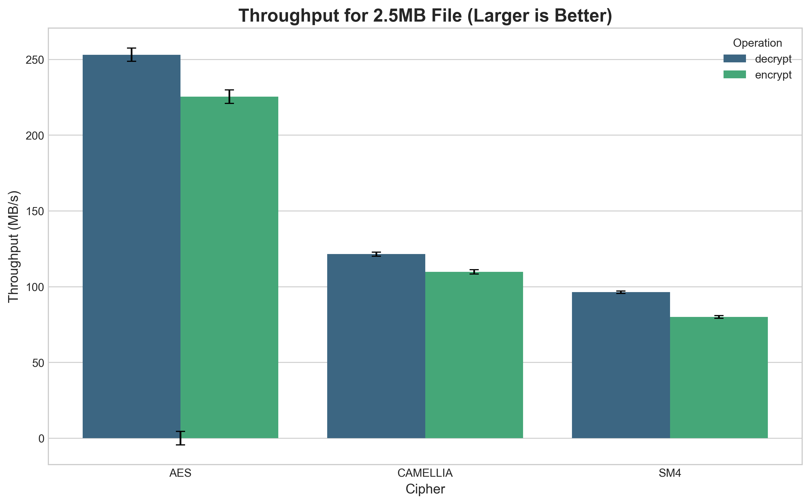
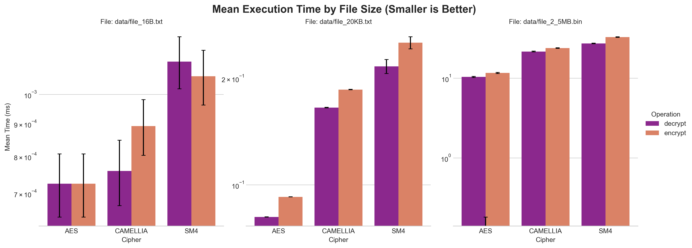

# OpenSSL Symmetric Cipher Performance Benchmark

**Author:** Edoardo Simonetti Spallotta 2077561
**Date:** October 19, 2025

## 1. Introduction

This report details a C++ benchmarking tool designed to measure and compare the performance of three symmetric block ciphers: AES, Camellia, and SM4. The implementation leverages the OpenSSL library's high-level EVP interface to ensure a standardized approach to cryptographic operations.

The primary objective is to provide a precise, reproducible, and insightful analysis of the computational cost associated with encrypting and decrypting data of varying sizes. The benchmark measures execution time, calculates throughput, and ensures the correctness of the cryptographic implementations.

## 2. Benchmarking Methodology

To ensure accurate and meaningful results, a rigorous methodology was established.

### 2.1. Benchmarked Ciphers

The following ciphers were selected for evaluation, all configured in Cipher Block Chaining (CBC) mode with a 128-bit key:

*   **AES-128-CBC:** The Advanced Encryption Standard, a widely adopted global standard.
*   **Camellia-128-CBC:** A Japanese cipher recognized for its strong security profile and performance, comparable to AES.
*   **SM4-CBC:** A Chinese national standard for block encryption, used in commercial and government applications.

A single 128-bit key and a 128-bit Initialization Vector (IV) are generated at the start of the benchmark using OpenSSL's cryptographically secure pseudo-random number generator (`RAND_bytes`) and are reused across all tests for consistency.

### 2.2. Test Data

Performance was evaluated against three distinct data sets to simulate different workloads:

1.  **Small Text File (`file_16B.txt`):** A 16-byte text file, representing a single block of data.
2.  **Medium Text File (`file_20KB.txt`):** A 20 KB text file, representing a typical small data payload.
3.  **Large Binary File (`file_2_5MB.bin`):** A 2.5 MB binary file, designed to test bulk data processing and measure sustained throughput.

The text files are generated using standard character streams, while the binary file is written byte-by-byte to prevent platform-specific text encoding or line-ending modifications.

### 2.3. Measurement Process

The core of the benchmark is its timing mechanism:

*   **High-Precision Timing:** Performance is measured using `std::chrono::steady_clock`, a monotonic clock that is not subject to system time adjustments, making it ideal for interval measurements.
*   **Isolated Operations:** Timing is strictly confined to the essential cryptographic function calls within the OpenSSL EVP interface: `EVP_*Init_ex`, `EVP_*Update`, and `EVP_*Final_ex`. File I/O, memory allocation, and other setup tasks are explicitly excluded from the measurements.
*   **Warm-up Phase:** Before timed measurements, a single warm-up encryption and decryption cycle is performed for each (cipher, file size) pair. This serves to load necessary library components into the CPU cache and mitigate first-run performance anomalies.
*   **Statistical Significance:** Each benchmark is executed in a loop for a predefined number of iterations (default: 5). The mean and standard deviation of these runs are then calculated to provide a statistically stable result.

### 2.4. Performance Metrics

The following metrics are captured for each test:

*   **Mean Time (ms):** The average execution time over the timed iterations.
*   **Standard Deviation (ms):** A measure of the variance and stability of the results.
*   **Throughput (MB/s):** Calculated as `(File Size in Bytes / 1,000,000) / (Mean Time in Seconds)`. This metric is most relevant for the large file size.

### 2.5. Correctness Verification

To guarantee the integrity of the cryptographic operations, a verification step is included. After each series of timed runs, the final generated ciphertext is decrypted, and the resulting plaintext is compared byte-for-byte against the original input data. The program will terminate with an error if a mismatch is detected.

## 3. Implementation Details

### 3.1. Project Structure

The project is organized into a clean and modular structure:

*   `src/`: Contains the C++ source code.
    *   `bench.cpp`: The main application driver. It orchestrates file generation, test execution, statistical calculations, and result reporting.
    *   `crypto_utils.cpp`: An abstraction layer that encapsulates all OpenSSL EVP API calls, providing clean `encrypt` and `decrypt` functions.
*   `include/`: Contains the header file `crypto_utils.hpp`.
*   `data/`: Directory where test files are generated.
*   `results/`: Directory where benchmark outputs (CSV and plots) are saved.
*   `CMakeLists.txt`: The build script for configuring the project and linking against OpenSSL.

### 3.2. Build System

The project is built using CMake, which handles compiler settings and dependency linking. The C++17 standard is enforced, and the build system links the executable against the `OpenSSL::Crypto` library.

## 4. How to Build and Run

### 4.1. Dependencies

*   **Build:** A C++17 compliant compiler, CMake (version 3.10+), and the OpenSSL library.
*   **Plotting (Optional):** Python 3, with the `pandas`, `matplotlib`, and `seaborn` libraries.

### 4.2. Build Instructions

Execute the following commands from the project root directory:

```sh
# Create a build directory
cmake -S . -B build

# Compile the project
cmake --build build -j
```

### 4.3. Running the Benchmark

Execute the compiled binary:

```sh
./build/bench
```

The program will automatically generate test data if it does not exist and then run the full benchmark suite. Console output will display real-time progress, and final results will be saved to `results/benchmark_results.csv`.

## 5. Results and Visualization

The raw performance data is stored in a comma-separated values (CSV) file for easy analysis. For visualization, a Python script is provided.

### 5.1. Generating Plots

To generate plots from the CSV data, first install the required Python packages:

```sh
# It is recommended to use a virtual environment
python3 -m venv .venv
source .venv/bin/activate
pip install pandas matplotlib seaborn
```

Then, run the plotting script:

```sh
python3 results/plot_results.py
```

This will generate the following plots in the `results/` directory:

*   **`throughput_comparison_with_stddev.png`**: A bar chart comparing the throughput (MB/s) of each cipher for the large 2.5MB file, including error bars representing standard deviation.
*   **`performance_comparison_with_stddev.png`**: A series of bar charts comparing the mean execution time (ms) for each cipher across all file sizes, presented on a logarithmic scale with error bars.

### 5.2. Included Plots


*Figure 1: Throughput comparison for the 2.5MB file.*


*Figure 2: Performance comparison across all file sizes.*
